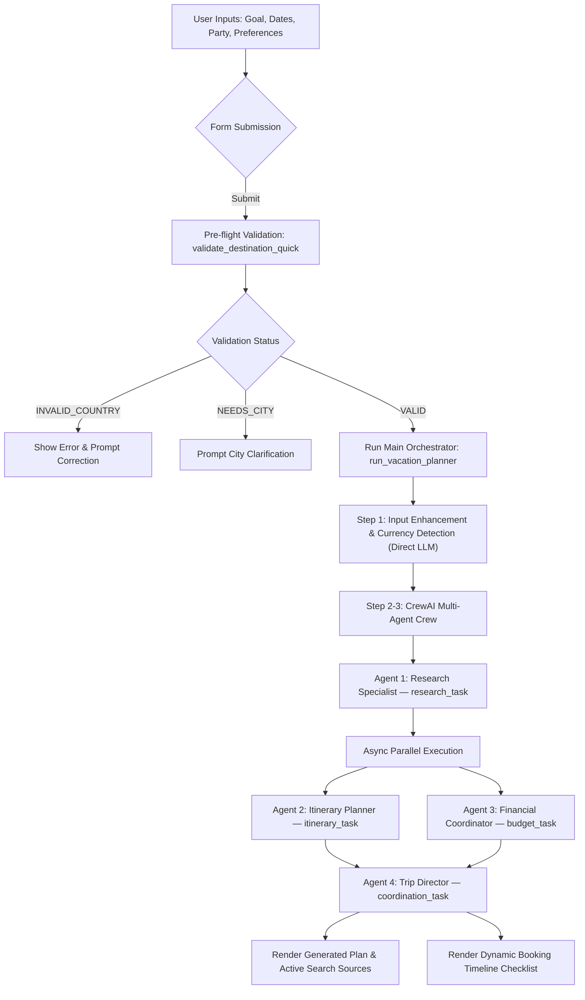

# 🌴 CrewAI Vacation Planner

An AI-powered multi-agent vacation planning application built with **CrewAI**, **LangChain OpenAI (GPT-4o-mini)**, and **Streamlit**.

It generates customized travel plans, day-by-day itineraries, itemized local currency budgets, money-saving tips, and interactive booking timelines.

---

## ✨ Key Features & Functionalities

* **🤖 CrewAI Multi-Agent Collaboration:** Orchestrates 4 specialized CrewAI agents (`Agent`, `Task`, `Crew`, `Process`) running parallel and sequential workflows for travel research, budgeting, itinerary synthesis, and master plan compilation.
* **⚡ Speed & Parallel Execution:** Itinerary synthesis and local budget calculations run concurrently using CrewAI's `async_execution=True` to minimize response latency.
* **📍 Pre-Flight Destination Validation:** Uses a lightweight direct LLM call to instantly validate destination names and prompt for city details (e.g., if only a state is provided) before starting the full agent crew.
* **💵 Dynamic Currency Detection:** Automatically detects the destination country, identifies its local currency (e.g., JPY, EUR, INR), and extracts the currency symbol without static lookup tables.
* **📅 Past Date Correction:** Automatically detects past travel dates and shifts them into the future while preserving trip duration.
* **👥 Traveler-Aware Personalization:** Dynamically tailors accommodation, pace, lodging layout (family apartment vs. solo room), and activity choices based on travel group composition (solo, couple, family with kids).
* **🌐 Live Web Source Citations:** Tracks and renders real-time Web URLs fetched by agents via a custom `TrackedTavilySearchTool`.
* **🧮 Shared Math Engine & Interactive Calculator:** Standalone budget tab and CrewAI `TripCostCalculatorTool` sharing a pure Python math engine for itemized category breakdowns, distribution charts, and exportable `.txt` trip reports.

---

## 📈 Application Execution Flow



---

## 🤖 CrewAI Agent Architecture

The application uses **CrewAI** (`Agent`, `Task`, `Crew`, `Process`) to orchestrate four specialized planning agents running sequential and concurrent tasks:

| Agent Role | Responsibility | Tools Used | Execution Mode |
| :--- | :--- | :--- | :--- |
| **🔍 Research Specialist** | Researches flight tiers, unique accommodations, local transport options, and custom attractions. | `TrackedTavilySearchTool` | Sequential (runs first) |
| **📅 Itinerary Planner** | Designs daily schedules with travel buffers and group pacing recommendations. | None (LLM direct) | **Async parallel** with Budget |
| **💰 Financial Coordinator** | Projects itemized local budgets, adds buffers, and calculates grand totals. | `TrackedTavilySearchTool`, `CalculatorTool`, `TripCostCalculatorTool` | **Async parallel** with Itinerary |
| **📋 Trip Director** | Merges all outputs into the final polished travel plan deliverable. | `CalculatorTool`, `TripCostCalculatorTool`, Crew Context | Sequential (runs last) |

> [!NOTE]
> **Latest CrewAI Features Utilized**:
> - **Async Parallel Execution (`async_execution=True`)**: Runs itinerary and financial tasks concurrently.
> - **Tool & Reasoning Caching (`cache=True`)**: Uses CrewAI's native tool caching layer to prevent duplicate web search calls.
> - **Agent Iteration Guardrails (`max_iter=3`, `max_execution_time=120`)**: Enforces strict execution limits to eliminate stuck loops and guarantee fast response times.
> - **Direct LLM Pre-Flight**: Uses `ChatOpenAI.invoke()` for 3 fast single-shot pre-flight checks (Validation, Enhancement, Currency) before launching the agent crew.

---

## 🔧 Tools Integration

1. **`TrackedTavilySearchTool`**:
   - A custom CrewAI `BaseTool` subclass that wraps the `tavily-python` client.
   - Performs web searches for flight pricing, lodging rates, and attraction fees while capturing URLs into `_active_search_sources` for citation in Streamlit.
2. **`CalculatorTool`**:
   - A lightweight arithmetic tool for evaluating expressions safely (`eval` with clean math names).
3. **`TripCostCalculatorTool`**:
   - Built directly on top of `cost_calculator.py` math engine.
   - Computes structured itemized costs (flights, hotel, food, transit, activities, contingency, total, per-person spend).

---

## 📁 Project Architecture & File Breakdown

The project follows a clean, modular structure:

* **[app.py](file:///c:/Sonam/Word/IITM/Vocareum%20Practice/VacationPlanning/app.py)**:
  Main entry point. Coordinates Streamlit UI, theme styling, tabs, form inputs, and status displays.
* **[crew_planner.py](file:///c:/Sonam/Word/IITM/Vocareum%20Practice/VacationPlanning/crew_planner.py)**:
  Core multi-agent orchestration engine. Houses the 4 CrewAI agents (*Research Specialist*, *Itinerary Planner*, *Financial Coordinator*, *Trip Director*), workflow tasks, `TrackedTavilySearchTool`, `CalculatorTool`, pre-flight destination validation, and dynamic currency detection.
* **[cost_calculator.py](file:///c:/Sonam/Word/IITM/Vocareum%20Practice/VacationPlanning/cost_calculator.py)**:
  Shared trip budget math engine (`calculate_trip_budget`), interactive cost calculator Streamlit tab UI (`render_cost_calculator`), and exported CrewAI tool (`TripCostCalculatorTool`).
* **[utils.py](file:///c:/Sonam/Word/IITM/Vocareum%20Practice/VacationPlanning/utils.py)**:
  Centralized home for all stateless helper utilities across the application:
  - `setup_safe_console_output()` & `UnicodeSafeWriter`: Global console encoding safety for Windows emoji & currency symbol output.
  - `validate_and_adjust_dates()`: Intelligent date parser & automatic past-date shifter.
  - `generate_booking_timeline()`: Dynamic booking checklist timeline generator with **ASAP ⚡** flags for passed deadlines.
  - `get_currency_symbol()` & `format_currency_amount()`: Currency symbol extraction & string formatting.
  - `generate_default_demo_dates()`: Dynamic demo fallback dates calculator.

---

## 🛠️ Setup & Local Execution

### Prerequisites
* **Python 3.10+** installed on your system.

### 1. Install Dependencies
```bash
pip install -r requirements.txt
```

### 2. Configure Environment Variables
Create a `.env` file in the root directory:
```env
OPENAI_API_KEY=your_openai_api_key_here
TAVILY_API_KEY=your_tavily_api_key_here  # Optional: For live web search & real-time pricing
```

### 3. Run the Streamlit Application
```bash
streamlit run app.py
```
Open your browser at `http://localhost:8501` to use the Vacation Planner.
